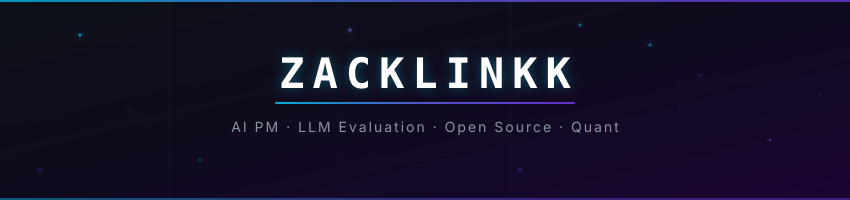

<div align="center">

<!-- Banner -->


<!-- Typing Animation -->
<a href="https://github.com/Zacklinkk">
  
</a>

<br/>

<!-- Social Badges -->
[](https://github.com/Zacklinkk)
[](https://github.com/Zacklinkk)

</div>

## `> whoami`

```text
🔬 Benchmark analysis — tracing scores, execution paths, task definitions, and graders
🧪 Evaluation workflows — failure attribution, verification, and reproducible evidence
🛠️ Open-source builder — agent tooling, skills, and desktop plugins
```

## `> cat selected_repository.md`

### [🔍 bench-analysis-skill](https://github.com/Zacklinkk/bench-analysis-skill)

A public, reusable workflow for diagnosing benchmark failures from scores, execution traces, task definitions, and grader behavior.

[Failure-attribution flow](https://github.com/Zacklinkk/bench-analysis-skill/blob/main/docs/failure-attribution-flow.md) · [Synthetic example report](https://github.com/Zacklinkk/bench-analysis-skill/blob/main/examples/example-report.md) · [Analysis scripts](https://github.com/Zacklinkk/bench-analysis-skill/tree/main/scripts)

  

## `> cat oh_my_dsh_plugins.md` · Oh My DSH Plugins

Selected projects I create and maintain in the [Oh My DSH](https://github.com/omdsh-dev) ecosystem:

| Project | What it does |
|---|---|
| [dsh-longbridge](https://github.com/omdsh-dev/dsh-longbridge) | Longbridge market data, account, positions, and trading tools |
| [dsh-book2skill](https://github.com/omdsh-dev/dsh-book2skill) | Five-stage book-to-skill workflow with three human gates |
| [dsh-paddle-ocr](https://github.com/omdsh-dev/dsh-paddle-ocr) | PaddleOCR-VL document layout parsing to Markdown |
| [dsh-voice-funasr](https://github.com/omdsh-dev/dsh-voice-funasr) | Local offline FunASR voice input with LLM polishing |

[Explore all Oh My DSH repositories →](https://github.com/orgs/omdsh-dev/repositories)

<div align="center">

<!-- Signature -->
<br/>

```
行动　·　等待　·　接受
```

<sub>Built with curiosity. Powered by open source.</sub>

<br/>

</div>
